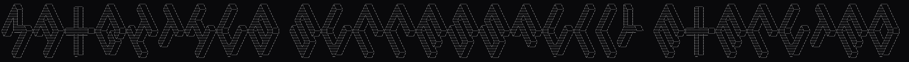

````md
<div align="center">

<!-- If you don't have the banner yet, delete the next line (or add the file at /assets/terminal-banner.gif) -->



</div>

```console
themaxempire23@github:~$ whoami
MAX

themaxempire23@github:~$ cat /etc/role
Machine Learning • Data • Building useful tools

themaxempire23@github:~$ cat /etc/now
- learning in public
- building ML projects that solve real problems
- keeping things clean: reproducible, documented, deployable

themaxempire23@github:~$ ls -lah projects/
drwxr-xr-x  3 max  staff   96  ml-projects
drwxr-xr-x  2 max  staff   64  notebooks
drwxr-xr-x  2 max  staff   64  mlops-lab

themaxempire23@github:~$ python -c "print('always be evaluating ✅')"
always be evaluating ✅
````

---

### $ skills --ml

* **Core:** data cleaning, feature engineering, model training, evaluation, error analysis
* **NLP:** preprocessing, embeddings, text classification, retrieval (RAG basics)
* **Vision:** image classification, detection (starter projects), augmentation
* **MLOps:** experiment tracking, model packaging, simple APIs, basic CI

---

### $ toolbox

<p align="center">
  
  
  
  
  
  
  
  
</p>

---

### $ projects --slots

> Replace `COMING_SOON_xx` with real repo names as you build (keep the slot order — it looks clean over time).

* **🧠 Slot 01 — ML Project** *(COMING SOON)*
  `Repo:` [https://github.com/themaxempire23/COMING_SOON_01](https://github.com/themaxempire23/COMING_SOON_01)
  `Plan:` dataset → baseline → metrics → improvements → demo

* **🔎 Slot 02 — NLP Project** *(COMING SOON)*
  `Repo:` [https://github.com/themaxempire23/COMING_SOON_02](https://github.com/themaxempire23/COMING_SOON_02)
  `Plan:` preprocessing → model → evaluation → error analysis → README

* **👁️ Slot 03 — Vision Project** *(COMING SOON)*
  `Repo:` [https://github.com/themaxempire23/COMING_SOON_03](https://github.com/themaxempire23/COMING_SOON_03)
  `Plan:` augment → train → evaluate → confusion matrix → demo

<details>
<summary><b>$ cat project-checklist</b></summary>

* ✅ Clear README (what, why, how to run)
* ✅ Dataset/source link + license notes
* ✅ Metrics + graphs (accuracy/F1/ROC, etc.)
* ✅ Reproducible setup (requirements.txt / environment.yml)
* ✅ Screenshots or a short demo GIF/video

</details>

---

### $ github --stats

<div align="center">


</div>

---

### $ roadmap 2026

* [ ] Ship **3 solid ML projects** (real datasets + clear evaluation)
* [ ] Build **1 deployable project** (Streamlit/FastAPI)
* [ ] Learn **MLOps basics** (tracking, packaging, CI, simple deployment)
* [ ] Write **short project notes** (what worked, what failed, next steps)

---

### $ connect

* Portfolio: **coming soon**
* LinkedIn: **coming soon**
* Email: **coming soon**

<details>
<summary><b>$ cat README.tips</b></summary>

* Keep it simple: banner + terminal block + project slots + stats.
* Update the project slots as you ship — that's the whole flex.
* Avoid posting private details publicly unless you really want to.

</details>
```
::contentReference[oaicite:0]{index=0}
